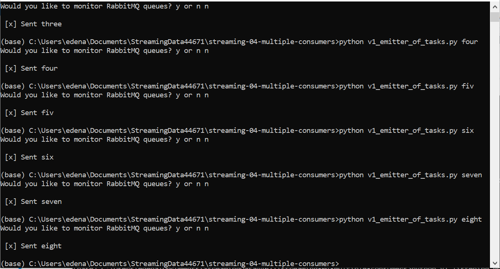
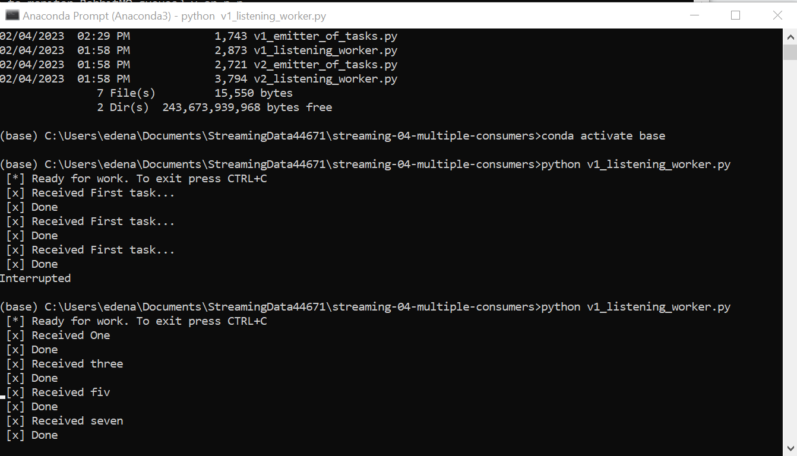
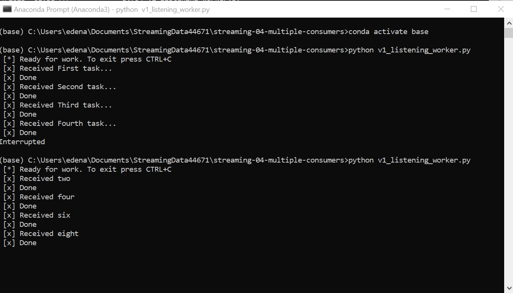
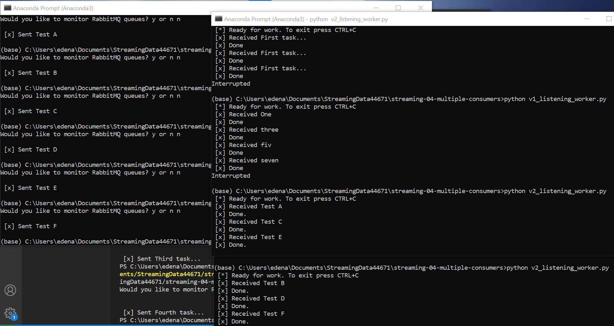
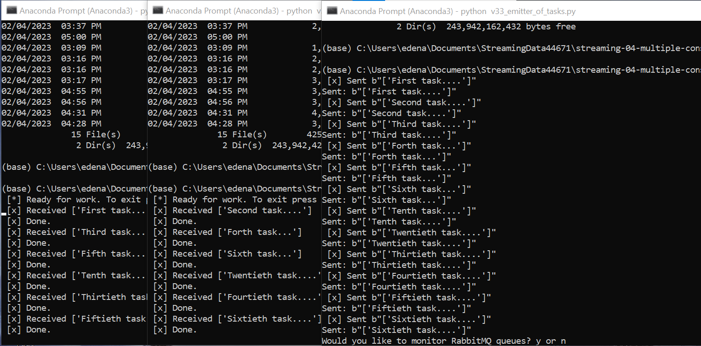

# Eden Anderson
## Streaming Data 44671 / Module 4 Assignment

# streaming-04-multiple-consumers

> Use RabbitMQ to distribute tasks to multiple workers

One process will create task messages. Multiple worker processes will share the work. 

## Before You Begin

1. Fork this starter repo into your GitHub.
1. Clone your repo down to your machine.
1. View / Command Palette - then Python: Select Interpreter
1. Select your conda environment. 

## Read

1. Read the [RabbitMQ Tutorial - Work Queues](https://www.rabbitmq.com/tutorials/tutorial-two-python.html)
1. Read the code and comments in this repo.

## RabbitMQ Admin 

RabbitMQ comes with an admin panel. When you run the task emitter, reply y to open it. 

(Python makes it easy to open a web page - see the code to learn how.)

## Execute the Producer

1. Run emitter_of_tasks.py (say y to monitor RabbitMQ queues)

Explore the RabbitMQ website.

## Execute a Consumer / Worker

1. Run listening_worker.py

Will it terminate on its own? How do you know? No - The message kept being received.  When all the existing messages have been received, the listener seems to wait for a new message.  (Plus, the first line reads to Ctrl-C to exit.)

## Ready for Work

1. Use your emitter_of_tasks to produce more task messages.

## Start Another Listening Worker 

1. Use your listening_worker.py script to launch a second worker. 

Follow the tutorial. 
Add multiple tasks (e.g. First message, Second message, etc.)
How are tasks distributed? The tasks alternate:  Since I sent consecutive numbers, the the consumers alternated and received either odd or even, but not both.
Monitor the windows with at least two workers. 
Which worker gets which tasks?  The first worker I opened received the first and third tasks.

## Reference

- [RabbitMQ Tutorial - Work Queues](https://www.rabbitmq.com/tutorials/tutorial-two-python.html)

## Screenshot

See a running example with at least 3 concurrent process windows here:

# Producer

# Worker 1

# Worker 2

# Using V2

# Using V3
